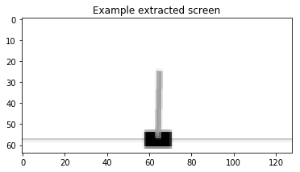
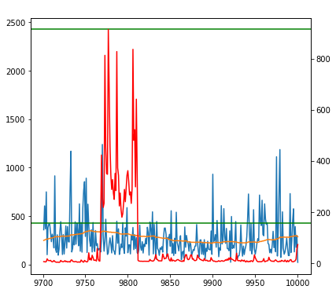

# Simple-DQN-Pytorch

This is a simplistic implemetation of DQN that works under CartPole-v0 with __rendered pixels__ as input. It extends the implementation of pytorch's official DQN tutorial (which doesn't actually work) [https://pytorch.org/tutorials/intermediate/reinforcement_q_learning.html](https://pytorch.org/tutorials/intermediate/reinforcement_q_learning.html).

It's tuned specifically for CartPole-v0 and will possibly fail for other tasks.

## Requirements

* pytorch 1.0+
* torchvision
* openai gym
* matplotlib
* Pillow

## Performance

Due to the randomness of the DQN algorithm (random trainging samples & random network initialization), the training is not deterministic. You may have to restart a few times to get a satisfying result.

The following 3 experiment results came from the same set of hyperparameters:

| Trial | Max reward | Max 100-mean | Total episodes | Solved after (episodes) |
| ----- | ---------- | ------------ | -------------- | ----------------------- |
| 0 | 1600 | 220 | 5000 | 3000 |
| 1 | 900 | 160 | 5000 | - |
| 2 | 2500 | 500 | 10000 | 700 |

*The last column indicates when the 100-mean reached 200.*

Last 300 episode history of training:

* Blue curve: episode reward
* Red curve: episode loss
* Orange curve: 100-mean
* Higher green line: max reward
* Lower green line: max 100-mean

## Implementation

### Methods

* Preprocess:
  * stack last 3 frames
  * grayscale, crop, resize
* Net work:
  * conv: 4 layers with a kernel size of 5 and stride of 2
  * flatten: simply reshape all pixels from conv output
  * output: fully connect flattened features to produce 1 output for Value and 2 outputs for Advantage
* Double DQN
* Dueling DQN
* Prioritized replay memory
* Adam optimizaer
* MSE loss
* Seperate render thread

### Hyperparameters

| Parameter | Value |
| --------- | ----- |
| Learning rate | 3e-5 |
| Target net update (steps) | 200 |
| Batch size | 256 |
| Gamma | 1 |
| Memory size | 10000 |
| Memory alpha | 0.6 |
| Memory beta start | 0.4 |
| Memory beta frames | 10000 |
| eps start | 1.0 |
| eps end | 0.01 |
| eps decay | 10 |

## Other Observations

* The training loss never converges, while performance keeps improving.
* Training is very sensitive to hyperparameter changes.
* Although the 100-mean is quite high and stable after some training, the network may still perform some terrible moves.
* It's quite sensitive to initialization, which can only be controlled with a random seed.
* High rate of random sample rate (epsilon) seems to ruin the training. Only a small one works.